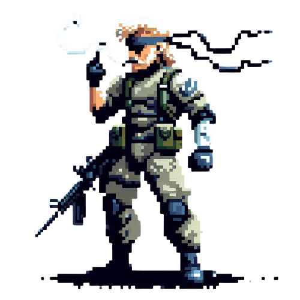

 
<h2>
    <em>Currículum</em> minimalista maquetado para la web e imprimir o descargar en PDF, Este currículum es totalmente editable desde Google Sheets
</h2>

## 🛠️ Stack

- [](https://reactjs.org/)

- [](https://nextjs.org/)

- [](https://www.typescriptlang.org/)

- [](https://developer.mozilla.org/en-US/docs/Web/JavaScript)

- [](https://developer.mozilla.org/en-US/docs/Web/CSS)

- [](https://tailwindcss.com/)

## 🚀 Para Empezar

### 1. Puedes usar este repositorio para tu proyecto personal

- Yo uso [pnpm](https://pnpm.io/installation) como gestor de dependencias y empaquetador.

### 2. Lanza el servidor de desarrollo:

```bash
pnpm dev
# Si no usas pnpm
npm run dev
```

<p>
Basado en el diseño de <a href="https://github.com/BartoszJarocki/cv">Bartosz Jarocki</a>
</p>

<div>

</div>

#

<div align="center">
  <p>NeoTecs Dev ©2023</p>
</div>
